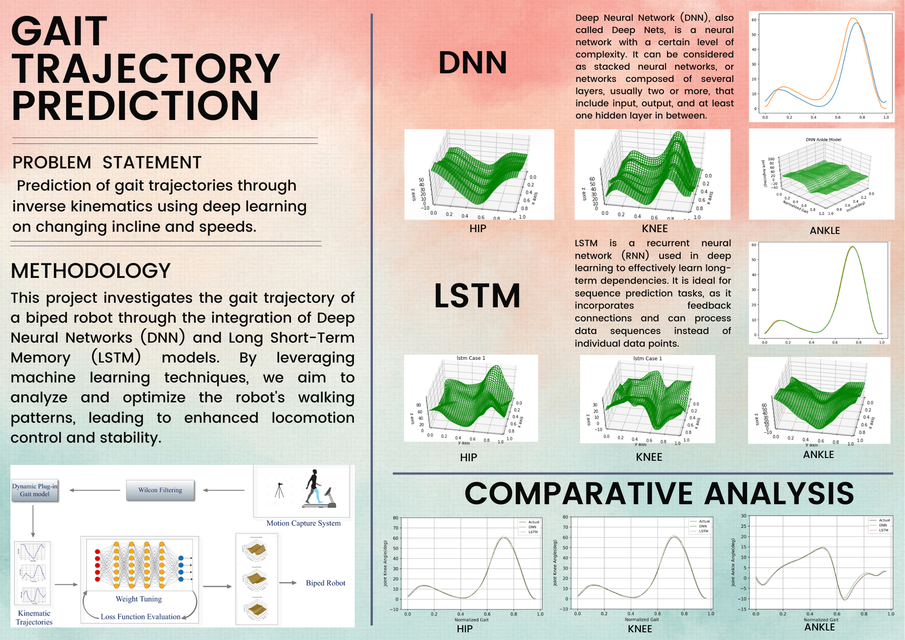

# Project Title: Gait Related Prediction using Deep Neural Networks (DNN) and LSTM

 <!-- Replace 'image.png' with your image file name and place the image file in the same directory as this README.md file -->

## Description

This project focuses on creating an advanced prediction system for gate-related scenarios using Deep Neural Networks (DNN) and Long Short-Term Memory (LSTM) networks. The primary objective is to develop a sophisticated model that can accurately predict gate-related outcomes based on various input factors.

## Features

- **DNN and LSTM Architecture**: The project employs a combination of DNN and LSTM architectures to effectively capture and learn from complex patterns within the input data.

- **Activation Function: Mean Square Error (MSE)**: The Mean Square Error is chosen as the activation function for its ability to effectively measure the discrepancy between predicted and actual values, leading to improved accuracy in prediction.

- **ReLU and Leaky ReLU Activation**: Rectified Linear Unit (ReLU) and Leaky ReLU activation functions are utilized to introduce non-linearity into the model, enabling better representation of intricate relationships within the data.

## Project Components

1. **Data Collection and Preprocessing**: Gather relevant gate-related data and preprocess it to ensure consistency and suitability for training.

2. **Model Architecture**: Develop a hybrid model incorporating both DNN and LSTM layers. Configure activation functions such as ReLU and Leaky ReLU.

3. **Training and Optimization**: Train the model using the preprocessed data and optimize it using MSE as the loss function. Utilize appropriate optimization techniques to enhance convergence.

4. **Evaluation and Validation**: Evaluate the model's performance using validation data. Employ relevant metrics to assess accuracy and robustness.

5. **Prediction and Visualization**: Apply the trained model to predict gate-related outcomes. Visualize the predictions to aid in result interpretation.

6. **Fine-Tuning**: Fine-tune the model parameters and hyperparameters iteratively to enhance accuracy and generalization.

## Installation

1. Clone the repository: `git clone https://github.com/your-username/your-project.git`
2. Install the required dependencies: `tenserflow, keras, cuda, cudnn`

## Credits

This project is a collaborative effort by [Chaitanya Khurana] and [Aryan Rana] under the mentorship of [Mr. Suchit Bhai Patel][LinkedIn](https://www.linkedin.com/in/suchit-patel-91a24116b).

## License

This project is licensed under the [MIT License](LICENSE).

---

